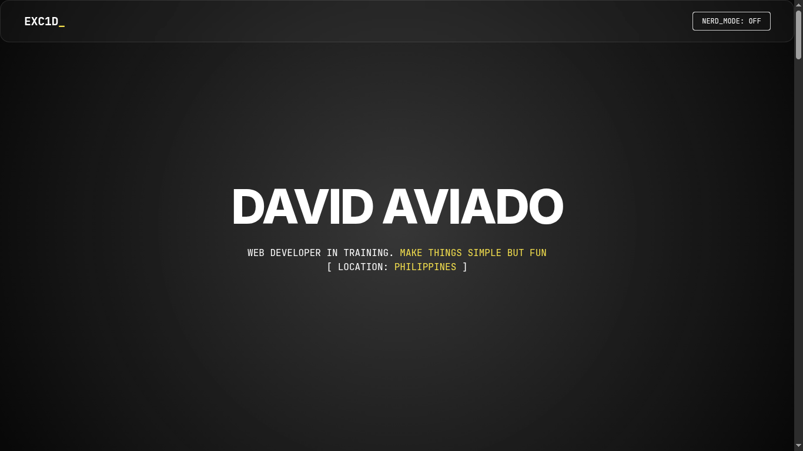

# Exc1D // Full-Stack Developer Portfolio

A personal portfolio website and **playground** for mini-projects built during my learning journey. Features a dual-mode design: clean **Elegant** mode by default, and a **Nerd Mode** toggle that unleashes a full Cyberpunk / Sci-Fi interface with glitch effects, scanlines, and a red accent.



**Live Demo:** [https://first-portfolio-virid.vercel.app/]

## ⚡ Key Features

- **System "Debug Mode":** A toggleable state that reveals grid overlays, changes system text, and alters the visual theme to a "blueprint/wireframe" style.
- **Dynamic Project Tracks:** Projects are loaded via JSON and sorted into horizontal scrolling tracks (Personal, Odin Project, Scrimba, Frontend Mentor).
- **Live GitHub Feed:** Connects to the GitHub API to display the user's 3 most recent push events in real-time.
- **The Repair Shop:** A "Bug Counter" that persists data using `localStorage` and a changelog of site updates.
- **Glassmorphism UI:** Custom CSS implementation of frosted glass effects with dynamic hover states.
- **Responsive Design:** Fully fluid layout that adapts from desktop monitors to mobile viewports.

## 🛠️ Tech Stack

- **Core:** Semantic HTML5, CSS3 (Variables, Flexbox, Grid), Vanilla JavaScript (ES6+).
- **Styling:**
- Custom CSS Variables for theming.
- `backdrop-filter` for glass effects.
- CSS Animations (Glitch effects, Scroll Reveal).

- **Data:**
- `projects.json` for portfolio items.
- `localStorage` for persistent interaction data.
- GitHub REST API for activity feeds.

- **Fonts:** Inter & JetBrains Mono (via Google Fonts).

## 🚀 Installation & Setup

Because this project uses `fetch()` to load JSON data and API requests, **it must be run on a local server** to avoid CORS (Cross-Origin Resource Sharing) errors. You cannot simply open `index.html` directly from a file folder.

### 1. Clone the Repository

```bash
git clone https://github.com/Exc1D/your-repo-name.git
cd your-repo-name

```

### 2. Add a New Project

Open `projects.json` and add a new entry to the array. That's it — the site renders it automatically.

```json
{
  "title": "My New Project",
  "category": "personal",
  "description": "One sentence about what it does.",
  "tech": ["HTML", "CSS", "JS"],
  "image": "assets/my-new-project.png",
  "demo": "https://your-live-demo.com",
  "github": "https://github.com/your/repo"
}
```

**Valid categories:** `personal`, `the-odin-project`, `scrimba`, `frontend-mentor`

> To add a new category, add a new entry to `TRACK_MAP` in `js/config.js`.

### 3. Run Locally

If you use VS Code, install the **Live Server** extension.

1. Open the project folder in VS Code.
2. Right-click `index.html`.
3. Select "Open with Live Server".

## ⚙️ Configuration

All configuration lives in **`js/config.js`** — this is the only file you need to touch for common changes:

| What to change | Where |
|---|---|
| GitHub username (live feed) | `js/config.js` → top of file (hardcoded in `fetchGitHubCommits`) |
| Add a new project category | `js/config.js` → `TRACK_MAP` |
| Add a tech badge color | `js/config.js` → `TECH_COLORS` |
| Nerd mode system tags | `js/config.js` → `SYSTEM_TAGS_CONFIG` |

## 📂 Project Structure

```text
/
├── index.html          # Markup — edit for bio, experience, tech stack
├── projects.json       # ← ADD PROJECTS HERE (one object per project)
├── assets/             # Project screenshots
│
├── js/
│   ├── config.js       # ← ALL CONFIG (categories, colors, text, tags)
│   └── main.js         # App logic (rendering, GitHub API, UI interactions)
│
└── css/
    ├── main.css        # Import hub — lists all CSS files in load order
    ├── variables.css   # Design tokens (:root CSS variables)
    ├── base.css        # Reset, body, utility classes, keyframe animations
    ├── components.css  # All UI components (navbar, cards, sections, footer)
    ├── nerd-mode.css   # All Nerd Mode overrides and effects
    └── responsive.css  # Media queries (900px, 768px, 480px)
```

## 🎨 Design System

**Elegant Mode (default)**
- Background: `#ffffff` / Surface: `#f5f5f7`
- Accent: `#0071e3` (Apple Blue)
- Font: Inter

**Nerd Mode**
- Background: `#000000` / Surface: `#0a0a0a`
- Accent: `#dc143c` (Crimson)
- Fonts: Syne (display) + JetBrains Mono (body)

## 📄 License

This project is open source and available under the [MIT License](https://www.google.com/search?q=LICENSE).

---

**© 2026 EXC1D STUDIO** // _Make things simple but fun._
